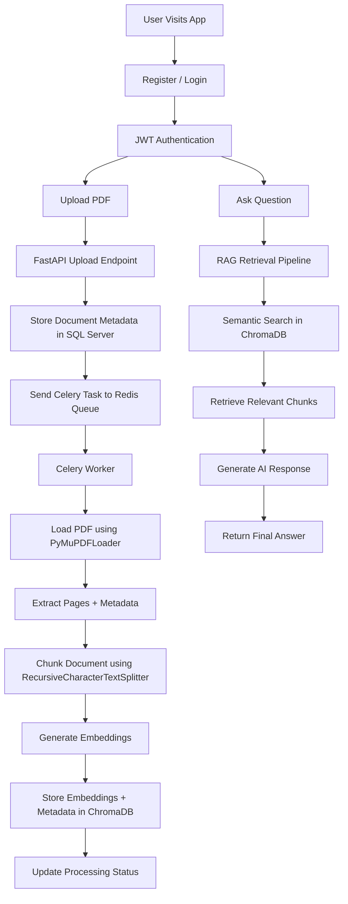
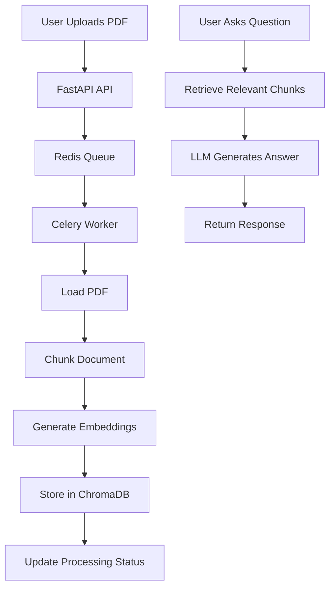

# DocQuery Backend

A FastAPI backend for a RAG-powered document intelligence system that supports asynchronous PDF ingestion, vector embedding generation, and retrieval-ready document indexing.

The project evolved from a basic RAG experiment into a production-style AI backend architecture using Celery workers, Redis queues, and ChromaDB vector storage.

---

# Stack

## Backend
- **FastAPI** — REST API framework
- **SQLAlchemy ORM** — database models and sessions
- **Microsoft SQL Server** — via `pyodbc`

## Async Processing
- **Celery** — distributed background task processing
- **Redis** — Celery broker + result backend

## AI / RAG Pipeline
- **LangChain** — document loading and processing
- **PyMuPDFLoader** — PDF ingestion
- **RecursiveCharacterTextSplitter** — document chunking
- **ChromaDB** — local vector database for embeddings

## Authentication
- **passlib + JWT** — password hashing and authentication

---

# Complete Architecture Flow



---

# Async Document Processing Workflow

The document ingestion pipeline runs asynchronously using Celery workers and Redis queues.

## Processing Stages

1. User uploads PDF
2. FastAPI stores document metadata
3. Celery task is pushed into Redis
4. Worker picks the task
5. PDF is loaded using PyMuPDFLoader
6. Document is chunked into smaller sections
7. Embeddings are generated
8. Chunks + metadata + embeddings are stored in ChromaDB
9. Processing progress is updated in SQL Server

---

# Celery Task Chaining Pipeline

The PDF pipeline is split into multiple Celery tasks:

```text
load_pdf_task
    ↓
create_chunks_task
    ↓
create_embeddings_task
    ↓
set_vector_store_task
```

This architecture improves:
- scalability
- debugging
- retries
- fault isolation
- progress tracking

---

# User Flow



---

# Project Structure

```text
app/
├── main.py                    # FastAPI entry point
├── core/
│   └── celery_app.py          # Celery configuration
├── routes/                    # API routes
├── tasks/                     # Celery background tasks
├── services/                  # Business logic
├── db/                        # Database session and engine
├── models/                    # SQLAlchemy models
├── schemas/                   # Pydantic schemas
├── utils/                     # Helper utilities
└── middleware/                # Middleware logic

chroma_db/                     # Local vector database
```

---

# Setup

## 1. Create Virtual Environment

```bash
python -m venv venv
.\venv\Scripts\activate
```

## 2. Install Dependencies

```bash
pip install -r requirements.txt
```

## 3. Configure Environment Variables

Create a `.env` file:

```env
DATABASE_URL=mssql+pyodbc://<user>:<password>@<server>/<database>?driver=ODBC+Driver+17+for+SQL+Server

SECRET_KEY=your_secret_key
ALGORITHM=HS256
ACCESS_TOKEN_EXPIRE_MINUTES=60
```

## 4. Start Redis

Make sure Redis server is running locally.

## 5. Run FastAPI Server

```bash
uvicorn app.main:app --reload
```

## 6. Run Celery Worker

```bash
celery -A app.core.celery_app.celery_app worker --pool=solo --loglevel=info
```

> `--pool=solo` is recommended for Windows development environments.

## 7. Explore API Docs

Visit:

```text
http://127.0.0.1:8000/docs
```

---

# Current Features

- JWT Authentication
- PDF Upload APIs
- Async Background Processing
- Celery + Redis Integration
- Celery Task Chaining
- ChromaDB Vector Storage
- Metadata-Preserving Chunking
- Progress Tracking
- SQL Server Integration
- RAG Retrieval Pipeline

---

# Notes

- Never commit `.env` files or secrets
- Add `chroma_db/` to `.gitignore`
- Redis must be running before starting Celery workers
- Celery workers run as separate processes and require proper task imports
- LangChain documents and NumPy arrays must be serialized before passing through Celery tasks
