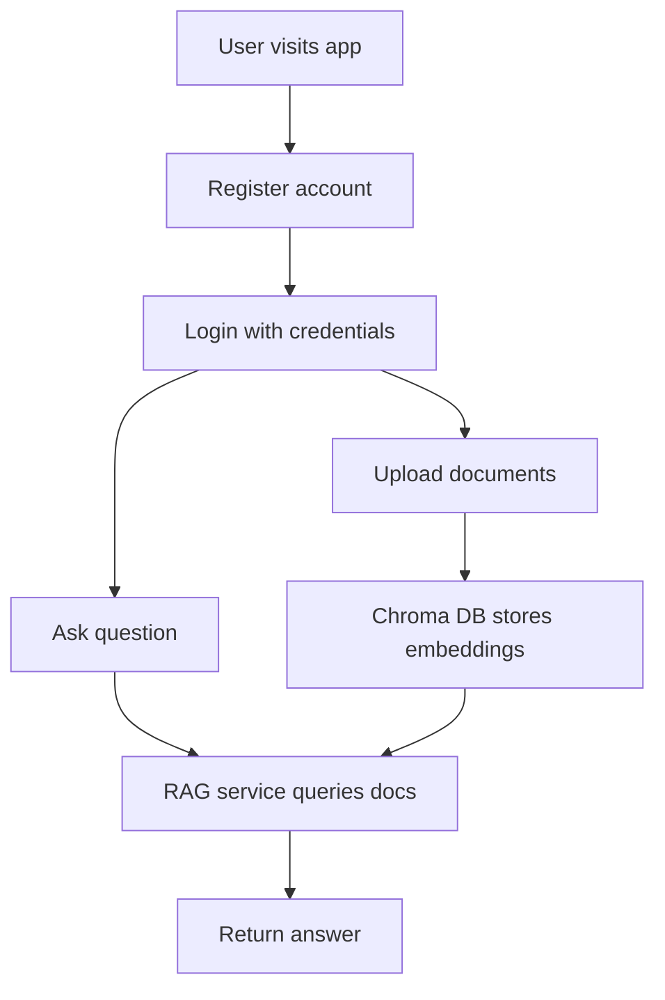

# DocQuery Backend

A FastAPI backend for a RAG-powered document query application, exposing search and retrieval as a clean REST API for frontend consumption.

## Stack

- **FastAPI** — REST API framework
- **SQLAlchemy ORM** — database models and sessions
- **Microsoft SQL Server** — via `pyodbc`
- **Chroma DB** — local vector store for embeddings
- **passlib + JWT** — password hashing and authentication

## User Flow



## Project Structure

```
app/
├── main.py          # FastAPI entry point
├── routes/          # API router definitions
├── services/        # Business logic and auth
├── db/              # Database session and engine
├── models/          # SQLAlchemy models
├── schemas/         # Pydantic request/response schemas
└── utils/           # Helpers (e.g. password hashing)
chroma_db/           # Local vector store (git-ignored)
```

## Setup

1. **Create and activate a virtual environment**

   ```bash
   python -m venv venv
   .\venv\Scripts\activate
   ```

2. **Install dependencies**

   ```bash
   pip install -r requirements.txt
   ```

3. **Configure environment variables** — create a `.env` file at the project root:

   ```env
   DATABASE_URL=mssql+pyodbc://<user>:<password>@<server>/<database>?driver=ODBC+Driver+17+for+SQL+Server
   SECRET_KEY=your_secret_key
   ALGORITHM=HS256
   ACCESS_TOKEN_EXPIRE_MINUTES=60
   ```

4. **Run the server**

   ```bash
   uvicorn app.main:app --reload
   ```

5. **Explore the API** — visit `http://127.0.0.1:8000/docs`

## Notes

- Never commit `.env` or any credentials to version control
- `chroma_db/` is local only — add it to `.gitignore`
